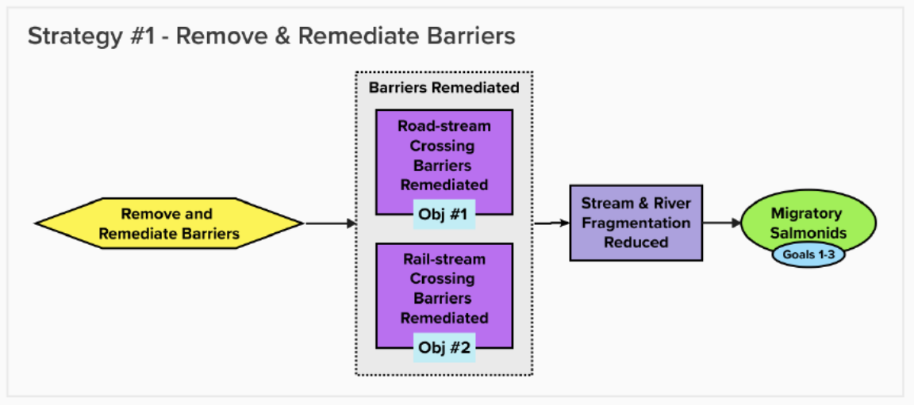

# Appendix C – Theories of Change {-}

## Theories of Change {-}
Theories of change explicitly state assumptions around how the identified actions will achieve gains in connectivity and contribute to achieving the goals of the plan. To develop theories of change, the Planning Team developed explicit assumptions for each strategy to clarify the rationale used for undertaking actions and provided an opportunity for feedback on invalid assumptions or missing opportunities. The theories of change are results oriented and clearly define the expected outcome. The following theory of change models were developed by the WCRP Planning Team to “map” the causal (“if-then”) progression of assumptions of how the actions within a strategy work together to achieve project goals. Further work to develop the theories of change model may be undertaken, in conjunction with a situation analysis to determine potential interventions at a future date. 

{#fig-strategy_1}