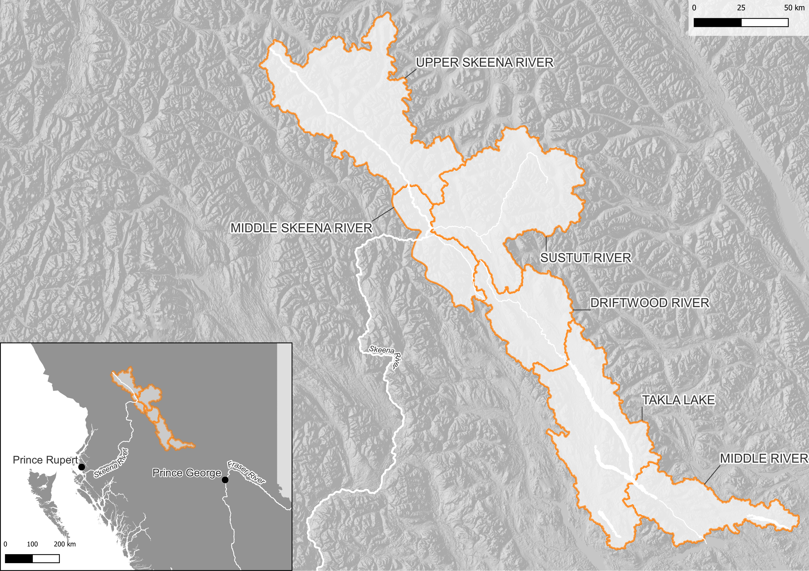

# Introduction {-}

## Purpose{-}
The purpose of this Watershed Connectivity Restoration Plan (WCRP) is to advance Takla Nation’s efforts to restore and strengthen connectivity for migratory salmonids and the cultural, ceremonial, and livelihood values they provide. Specifically, this WCRP focuses on habitat connectivity for Chinook Salmon (*Oncorhynchus tschawystcha*), Coho Salmon (*O. kisutch*), Sockeye Salmon (*O. nerka*), and steelhead (*O. mykiss*), herein referred to as Pacific salmon and steelhead, in the traditional unceded territory of the Takla Nation. This includes those portions of Takla Nation territory that support anadromous salmon: the Driftwood River, Takla Lake, Middle Skeena, Upper Skeena and Sustut River watersheds and portions of the Middle River watershed.  

This plan informs efforts to close knowledge gaps and plan and prioritize field assessments and restoration. Local data and knowledge are combined with connectivity modelling to estimate current connectivity status and identify structures that potentially block the most habitat. This informs the prioritization of field assessments to close the most significant knowledge gaps efficiently. Information from field assessments of barrier status and habitat condition are incorporated into the model, improving understanding of which barriers block the most habitat, and informing restoration prioritization. As knowledge gaps are closed and barriers are addressed, this plan will be revised to summarize progress and provide updated estimates of connectivity status and the status and relative importance of remaining structures. 

This information is also used to inform and plan restoration efforts. Structure rankings inform restoration prioritization by summarizing what is known about fragmentation and showing the relative amount of habitat upstream of each barrier. Actual prioritization of restoration activities is a social decision that requires additional information, including the quality and condition of upstream habitat, the cultural importance of different areas within the watershed, and the costs and logistics of addressing each barrier relative to the ecological benefits of doing so.  

As knowledge gaps are closed and barriers are addressed, this plan is revised to summarize progress and provide updated estimates of connectivity status and the status and relative importance of remaining structures

## Vision Statement  {-}
Healthy, connected streams and rivers across the Takla traditional territory sustain thriving migratory fish populations and the cultural, ceremonial, and livelihood values. Visitors respect the stewardship values of Takla Nation to remove and prevent barriers, strengthening the health of the territory for the benefit of present and future generations. 

## Scope  {-}
This WCRP focuses on habitat connectivity for Chinook salmon, Sockeye salmon, Coho Salmon and steelhead, herein referred to as Pacific salmon and steelhead, in the traditional unceded territory of the Takla Nation. This includes those portions of Takla Nation territory that support anadromous salmon: the Driftwood River, Takla Lake, Middle Skeena, Upper Skeena and Sustut River watersheds and a portion of the Middle River watershed (@fig-geoscope). Model outputs include an estimate of the current connectivity status along with structure ranks and counts. Structure ranking and connectivity estimates are based on all watersheds and species and life stages combined to provide a more comprehensive conservation planning focus for all diadromous fish species. 

Connectivity models in this WCRP focus on longitudinal habitat fragmentation by anthropogenic structures, including all types of dams and stream crossings. Natural barriers that could be managed to increase fish passage (i.e., beaver dams and log jams) are included as structures in connectivity models. Diffuse natural barriers that make entire areas impassible are not included in the models but may be used to define the scope of this WCRP. For example, a tributary that is inhospitable because of increased water temperature may be excluded from the overall spatial scope of the WCRP because restoration needs there are broader than connectivity.

{#fig-geoscope}

## Barrier Types {-}

Two barrier types were identified by the planning team as impeding connectivity for Pacific salmon and steelhead within the Driftwood River, Takla Lake, Middle River, Middle Skeena, Upper Skeena and Sustut River watersheds: road-stream crossings and rail-stream crossings. Beaver dams and log jams act as temporary, natural barriers throughout much of the geographic scope. Although the planning team acknowledges that these barriers can and do impede passage of Pacific salmon and steelhead in some years, they are not barrier types that are actively being targeted by this plan. Some known log jams and some beaver dams that are actively managed for passage by Fisheries and Oceans Canada and other First Nations with overlapping territories with Takla Nation are listed in Table 1. This is not an exhaustive list, and other beaver dams and log jams of varying size and permanence are also abundant throughout the project geographic scope. 

Table 1: Known beaver dams and log jams within Takla Nation traditional territory. Beaver dams and log jams are not actively being targeted by this plan. 
